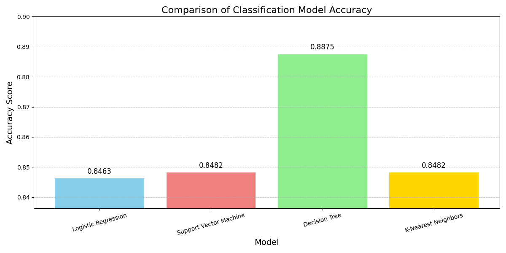
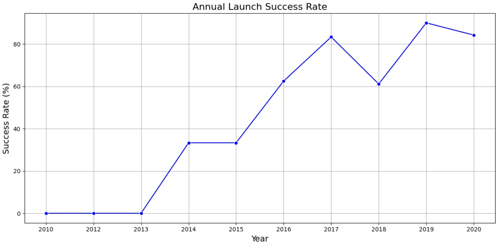
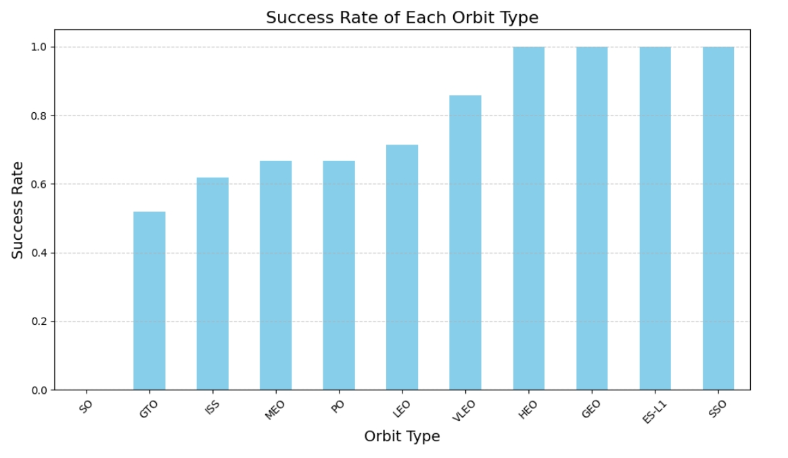

# 🚀 Falcon 9 First Stage Landing Prediction (Machine Learning)

  

<h2 align="center">Falcon9 Landing Prediction ML</h2>

<i>IBM/Coursera Data Science Capstone – Predicting the Future of Reusable Rockets</i>

---

## 🧭 Table of Contents
1. [Project Overview](#-project-overview)
2. [Modules Summary](#-modules-summary)
3. [Technologies Used](#-technologies-used)
4. [Key Deliverables](#-key-deliverables)
5. [Predictive Modeling Results](#-predictive-modeling-results)
6. [Key Analytical Findings](#-key-analytical-findings)
7. [Conclusions](#-conclusions)
8. [Author IBM Final Project](#-author-ibm-final-project)
9. [References](#-references)

---

## 📘 Project Overview

This repository contains a **data science capstone project** focused on predicting whether the **first stage** of the *SpaceX Falcon 9 rocket* will **land successfully**.  
Since reusability of the first stage drastically reduces launch costs, predicting landing outcomes is crucial for **cost estimation** and **competitive bidding** in the aerospace industry.

> 💡 **Business Context:**  
> A Falcon 9 launch costs about **$62 million**, compared to more than **$165 million** for other providers.  
> If we can accurately predict landing success, we can estimate the cost structure and assist potential competitors in making informed bids.

---

## 🧩 Modules Summary

### **Module 1 — Introduction & Foundations**
Gain an overview of the problem, define objectives, and learn the essential tools for analysis.

**Learning Objectives:**
- Develop Python code to manipulate data with Pandas  
- Convert JSON files into Pandas DataFrames  
- Create and share Jupyter Notebooks on GitHub  
- Define and structure real-world business problems  
- Clean and explore data to derive insights  

---

### **Module 2 — Data Collection & Exploration**
Collect Falcon 9 landing data via **REST APIs** and **web scraping**, transform it into DataFrames, and perform exploratory analysis.

**Learning Objectives:**
- Create scatter and bar plots for data exploration  
- Conduct exploratory data analysis (EDA) using Pandas  
- Write and execute **SQL queries** to query and sort data  
- Visualize patterns to guide machine learning modeling  

---

### **Module 3 — Interactive Dashboard & Mapping**
Build interactive dashboards using **Plotly Dash** and geographical visualizations with **Folium**.

**Learning Objectives:**
- Create interactive dashboards (pie charts, scatter plots)  
- Build maps to analyze launch site proximities  
- Calculate distances and cluster locations using Folium  
- Combine dashboards and maps for data storytelling  

---

### **Module 4 — Machine Learning Modeling**
Train and evaluate classification models to predict first-stage landing success.

**Learning Objectives:**
- Split dataset into training and test sets  
- Train models such as:
  - **Support Vector Machine (SVM)**
  - **Decision Trees**
  - **Logistic Regression**
- Tune hyperparameters via **Grid Search**  
- Evaluate model performance and select the best predictor  

---

### **Module 5 — Final Report & Insights**
Compile all findings into a comprehensive, data-driven report predicting Falcon 9 first-stage landing success.

**Learning Objectives:**
- Structure and communicate analytical findings  
- Submit and peer-review reports  
- Interpret and explain model results  

---

## 🛠 Technologies Used

| Category | Tools / Libraries |
|-----------|------------------|
| **Languages** | Python |
| **Data Analysis** | Pandas, NumPy |
| **Visualization** | Matplotlib, Seaborn, Plotly, Folium, Dash |
| **Machine Learning** | Scikit-learn |
| **Databases / Querying** | SQL |
| **Development Tools** | Jupyter Notebook, GitHub |
| **Data Sources** | SpaceX API, Wikipedia (web scraping) |

---

## 📊 Key Deliverables

- ✅ Cleaned and structured Falcon 9 dataset  
- 📓 Jupyter notebooks for each analysis stage  
- 📈 Interactive Plotly Dash dashboard  
- 🗺️ Folium map visualizations  
- 🤖 Trained ML models (SVM, Decision Tree, Logistic Regression)  
- 🧾 Final analytical report with insights and recommendations  

---

## 🤖 Predictive Modeling Results

| Model | Accuracy | Notes |
|--------|-----------|--------|
| Logistic Regression | 0.846 | Baseline linear model |
| SVM | 0.848 | Moderate performance |
| Decision Tree | **0.8875** | Best model overall |
| KNN | 0.848 | Similar to SVM |

  
   
  <em>Comparison of model accuracies — Decision Tree achieved the best performance (0.8875).</em>

> 🧠 **Best Model:** Decision Tree — achieved the highest accuracy and balanced precision/recall, with zero false negatives.

---

## 📈 Key Analytical Findings

  
   
  <em>Falcon 9 yearly launch success rate — showing strong reliability growth since 2010.</em>

1. **Operational Reliability:** Launch success rate improved from below 60% (2010–2013) to above 80% (2017–2020).  
2. **Orbit and Payload Impact:** Missions to **LEO** and **ISS** show higher success rates, even with heavier payloads.  
3. **Geospatial Insights:** Florida launch sites (**KSC LC-39A**, **CCAFS LC-40**) dominate, benefiting from coastal proximity.  
4. **Model Insights:** The **Decision Tree classifier (0.8875 accuracy)** is ideal for predicting landing success and aiding cost estimations.  
5. **Strategic Implication:** Falcon 9’s reusability drives a sustainable **cost advantage** validated through data.

  
   
  <em>Landing success rate by orbit type — LEO and ISS missions demonstrate highest reliability.</em>

---

## 🏁 Conclusions

- SpaceX achieved high operational maturity, with **99 successful launches out of 101 analyzed**.  
- The **Decision Tree model** proved to be the most reliable predictive tool (accuracy 0.8875).  
- **Launch site**, **orbit type**, and **booster version** are strong predictors of landing success.  
- Data-driven insights like these can support **cost estimation**, **mission planning**, and **operational optimization** in aerospace projects.

---

## ✍️ Author IBM Final Project 

**Erivelton Pinheiro de Menezes**  
_Data Science Capstone Project – Falcon 9 Landing Prediction_  

📧 [...]  
🌐 [GitHub: @eriveltonmenezes](https://github.com/eriveltonmenezes)

---

## 📚 References

- [Wikipedia - List of Falcon 9 and Falcon Heavy launches](https://en.wikipedia.org/w/index.php?title=List_of_Falcon_9_and_Falcon_Heavy_launches&oldid=1027686922)  
- [SpaceX Official Website](https://www.spacex.com/)

---

> ✨ *“Predicting the future of space exploration — one model at a time.”*

---
